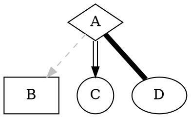
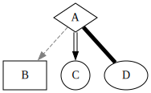

# Graphviz for Goldmark

This is an extension for [Goldmark](https://github.com/yuin/goldmark) that adds
support for generating figures using [Graphviz](https://graphviz.org/). It
doesn't rely on cgo or an external binary, instead using the
[wazero](https://wazero.io/) WebAssembly runtime to embed Graphviz.

## Usage

Register the extension:

``` go
goldmark.New(
	goldmark.WithExtensions(&graphviz.Extender{}),
).Convert(src, dst)
```

Fenced code blocks like below will now be rendered using Graphviz:

~~~markdown

~~~

Resulting in a figure like below:



## Performance

Performance will be the same as for the underlying
[go-graphviz](https://github.com/rigtorp/go-graphviz) package. For a small
Graphviz graph, go-graphviz takes about 51ms:

```shell
$ go test -test.bench .
goos: linux
goarch: amd64
pkg: github.com/rigtorp/go-graphviz
cpu: Intel(R) Core(TM) i7-8550U CPU @ 1.80GHz
BenchmarkGraphviz-8           24          51285746 ns/op
PASS
ok      github.com/rigtorp/go-graphviz  3.057s
```

## Acknowledgements

This extension is based on the
[goldmark-pikchr](https://github.com/jchenry/goldmark-pikchr) extension by
[Colin Henry](https://github.com/jchenry) and the
[goldmark-d2](https://github.com/FurqanSoftware/goldmark-d2) extension by
[Furqan Software](https://github.com/FurqanSoftware).
